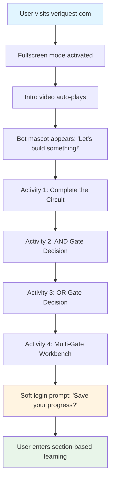

# Product Requirements Document: VeriQuest (Phase-1)

**Document Version:** 1.0  
**Last Updated:** January 23, 2026  
**Product Phase:** Phase-1 (Scope Locked)  
**Target Release:** Q1 2026  

---

## Executive Summary

VeriQuest is a web-based, game-like educational platform designed to teach digital logic fundamentals to absolute beginners, particularly 1st-year ECE students. Unlike traditional learning platforms that rely on theory-first approaches, VeriQuest employs a **Visual → Interaction → Intuition → Naming** pedagogy that prioritizes hands-on experimentation over lectures.

**Phase-1 Objective:** Deliver a fully immersive, pre-login experience with 4 interactive activities that teach signal concepts, hardware decision-making, and basic logic gates (AND/OR) without requiring any prior knowledge or account creation.

**Success Criteria:**
- 80%+ completion rate for all 4 pre-login activities
- Average session duration >8 minutes
- <5% drop-off rate during activities
- Positive qualitative feedback on "fun" and "clarity"

---

## Problem Statement

Current digital logic education suffers from three critical failures:

1. **Theory-first approach:** Students encounter Boolean algebra and truth tables before understanding *why* hardware makes decisions
2. **Syntax barriers:** Traditional tools (Verilog, VHDL) require coding knowledge before conceptual understanding
3. **Fear-based feedback:** Errors are punished rather than used as learning moments

**Result:** High dropout rates, low engagement, and poor retention among beginners.

**VeriQuest Solution:** An interaction-first platform where learning happens through play, not study. Users complete meaningful activities before ever seeing a login screen, building confidence and curiosity from the first interaction.

---

## Target Users & Use Cases

### Primary Persona: "First-Year Fatima"
- **Profile:** 1st-year ECE student, 18-19 years old
- **Background:** Comfortable with smartphones/web, zero hardware experience
- **Pain Points:** Intimidated by circuit diagrams, confused by abstract Boolean logic
- **Goals:** Understand "what engineers actually do" before diving into coursework
- **Success Metric:** Completes all 4 activities and voluntarily creates an account

### Secondary Persona: "Curious Carlos"
- **Profile:** High school student exploring engineering
- **Background:** Plays mobile games, watches tech YouTube
- **Pain Points:** Finds textbooks boring, wants hands-on experience
- **Goals:** Explore if hardware engineering is interesting
- **Success Metric:** Shares VeriQuest with friends after first session

### Use Cases

| Use Case | Description | Priority |
|----------|-------------|----------|
| **UC-1: First-time visitor** | User lands on site, watches intro video, completes 4 activities without login | P0 |
| **UC-2: Repeat learner** | User returns, logs in, continues section-based learning | P1 (Phase-2) |
| **UC-3: Mobile exploration** | User tries on mobile device (graceful degradation) | P2 (Phase-2) |

---

## Core Learning Philosophy

All design and implementation decisions must align with this philosophy:

### 1. Visual → Interaction → Intuition → Naming
- **Visual:** Show the circuit/component first
- **Interaction:** Let users manipulate it (drag, click, toggle)
- **Intuition:** Observe what happens (glow, sound, animation)
- **Naming:** Only then introduce terminology ("This is called an AND gate")

### 2. No Theory Dumps
- Maximum 1 sentence of text per interaction
- No formulas, equations, or truth tables in Phase-1
- Concepts emerge from doing, not reading

### 3. No Fear-Based Feedback
- Wrong actions trigger gentle bot hints, not error messages
- No red X's, buzzers, or "incorrect" labels
- Unlimited attempts with encouraging guidance

### 4. Learning Before Login
- First 4 activities are completely anonymous
- No email, password, or personal data required upfront
- Login prompt appears only after value is demonstrated

---

## Product Inspiration & Feel

VeriQuest should feel like a hybrid of:

| Product | Borrowed Element |
|---------|------------------|
| **Duolingo** | Progress bars, friendly mascot, bite-sized lessons, celebration animations |
| **Angry Birds** | Physical feedback (bounce, snap), satisfying sound effects, clear objectives |
| **Among Us (Electrical Tasks)** | Focused mini-games, drag-to-complete interactions, immediate visual feedback |

**NOT like:** Khan Academy (lecture-heavy), Codecademy (syntax-first), traditional LMS platforms (form-heavy)

---

## End-to-End User Flow (Phase-1)



### Flow Details

1. **Landing (0-5s):** Fullscreen takeover, no navbar, intro video starts
2. **Welcome (5-15s):** Bot appears with single-line greeting
3. **Activities (15s-8min):** 4 sequential drag-and-drop challenges
4. **Login Gate (8-9min):** Gentle prompt with "Continue as Guest" option
5. **Roadmap (9min+):** Duolingo-style section tree (Phase-2 scope)

---

## Functional Requirements: Pre-Login Activities

### Activity 1: Complete the Circuit

**Learning Objective:** Understand what a signal is (electricity flowing through a complete path)

**Interaction Flow:**
1. User sees incomplete circuit: battery on left, bulb on right, empty slots in between
2. Bot says: *"Drag the missing pieces to light up the bulb"*
3. Component tray shows: resistor, wire segment, random distractor (e.g., capacitor icon)
4. User drags resistor into slot → magnetic snap + thud sound
5. User drags wire → circuit completes
6. **Success state:** Wire glows yellow→orange, bulb lights up with soft bloom effect, spark animation, bot says *"You created a signal! Electricity is flowing."*

**Technical Specs:**
- SVG-based circuit with 2 empty slots (outlined with dashed borders)
- Drag targets have 20px snap radius
- Glow animation: 0.5s ease-in-out, CSS filter brightness(1.5)
- Sound: `thud.mp3` (50ms), `spark.mp3` (200ms)
- Wrong component → slot rejects with gentle shake (3px, 100ms)

**Acceptance Criteria:**
- [ ] Circuit completes only when correct components are placed
- [ ] Glow animation starts from battery and propagates to bulb (0.8s total)
- [ ] Bot message appears 0.5s after success animation
- [ ] User can reset and retry unlimited times

---

### Activity 2: AND Gate Decision

**Learning Objective:** Hardware can make decisions (output depends on inputs)

**Interaction Flow:**
1. User sees circuit with 2 switches (A, B), empty gate slot, and LED
2. Bot says: *"This gate only lights the LED when BOTH switches are ON"*
3. Component tray shows: AND gate icon, OR gate icon (distractor)
4. User drags AND gate into slot → snap + thud
5. User clicks switches to test:
   - A=OFF, B=OFF → LED stays dark
   - A=ON, B=OFF → LED stays dark
   - A=ON, B=ON → LED glows green + success sound
6. Bot says: *"That's an AND gate—it needs all inputs to say YES"*

**Technical Specs:**
- Switches: toggle on click, visual state change (lever rotates 30°, color shift gray→blue)
- AND gate: 2-input, 1-output, SVG icon with labeled inputs
- Boolean logic: `output = inputA && inputB` (client-side JS)
- LED glow: radial gradient green, pulsing animation (1s loop)
- Sound: `click.mp3` (switch), `success.mp3` (LED on)

**Acceptance Criteria:**
- [ ] LED only lights when both switches are ON
- [ ] Wrong gate (OR) can be placed but produces incorrect output
- [ ] Bot provides hint if user places OR gate: *"Hmm, try the other one"*
- [ ] Switch states persist during gate swapping

---

### Activity 3: OR Gate Decision

**Learning Objective:** Different gates make different decisions

**Interaction Flow:**
1. User sees similar setup: 2 switches, empty gate slot, LED
2. Bot says: *"This gate lights the LED when ANY switch is ON"*
3. Component tray shows: OR gate icon, AND gate icon (distractor)
4. User drags OR gate → snap + thud
5. User tests:
   - A=OFF, B=OFF → LED dark
   - A=ON, B=OFF → LED glows
   - A=OFF, B=ON → LED glows
   - A=ON, B=ON → LED glows
6. Bot says: *"That's an OR gate—it says YES if anyone agrees"*

**Technical Specs:**
- Identical switch/LED mechanics to Activity 2
- Boolean logic: `output = inputA || inputB`
- OR gate: distinct visual from AND (different icon shape)
- Comparison tooltip: Hovering over gate shows mini truth table (icons, no text)

**Acceptance Criteria:**
- [ ] LED lights when at least one switch is ON
- [ ] User can swap between AND/OR to see difference
- [ ] Bot provides comparative hint if user confuses gates

---

### Activity 4: Multi-Gate Mini Workbench

**Learning Objective:** Systems are built by combining gates

**Interaction Flow:**
1. User sees circuit with 3 inputs (A, B, C), 2 empty gate slots, 1 LED
2. Bot says: *"Build a circuit where the LED lights if A is ON AND (B or C) is ON"*
3. Component tray shows: 2× AND gates, 2× OR gates
4. User must:
   - Place OR gate to combine B and C
   - Place AND gate to combine A with OR output
5. Correct solution → LED lights, confetti animation, bot says *"You're a circuit builder now!"*

**Technical Specs:**
- 2-stage circuit: first gate outputs to second gate input
- Auto-connecting wires: animate from output to input (0.3s)
- Confetti: 20 particles, random colors, 2s duration (anime.js)
- Sound: `build-complete.mp3` (triumphant 1s melody)
- Hint system: After 2 incorrect attempts, bot highlights first gate slot

**Acceptance Criteria:**
- [ ] Only correct gate combination produces output
- [ ] Wires auto-route with smooth animation
- [ ] User can rearrange gates without penalty
- [ ] Confetti triggers only on first success (not on replay)

---

## Functional Requirements: Bot Character

### Character Design
- **Visual:** Friendly logic gate mascot with LED eyes (think Clippy meets Duolingo owl)
- **Personality:** Encouraging, playful, never condescending
- **Tone:** 1st-person plural ("Let's try this"), casual ("Nice!")

### Behavior Rules
- **Contextual appearance:** Fades in after user actions (not constantly visible)
- **Message length:** Maximum 8 words per message
- **Timing:** 0.5s delay after trigger event
- **Animation:** Gentle bounce-in from bottom-right corner

### Message Categories

| Trigger | Example Message | Tone |
|---------|----------------|------|
| Activity start | *"Let's build something!"* | Inviting |
| Correct action | *"Yes! See it glow?"* | Celebratory |
| Incorrect action | *"Hmm, try the other one"* | Gentle redirect |
| Stuck (30s no action) | *"Drag the battery here"* | Helpful hint |
| Activity complete | *"You're a natural!"* | Proud |

### Technical Implementation
- React component: `<BotMascot message={string} visible={boolean} />`
- CSS animations: fade-in (0.3s), bounce (0.2s)
- Z-index: 1000 (always on top)
- Position: fixed bottom-right, 80px from edges

---

## Functional Requirements: Interactive Simulator

### Core Capabilities
- **Drag-and-drop component placement**
- **Click-to-toggle switches**
- **Auto-connecting wires** (no manual routing)
- **Real-time boolean logic simulation** (client-side)
- **Visual feedback** (glow, color change, animation)

### Supported Components (Phase-1 Only)

| Component | Inputs | Outputs | Interaction | Visual State |
|-----------|--------|---------|-------------|--------------|
| Battery | 0 | 1 (power) | Static | Yellow glow |
| Resistor | 1 | 1 | Static | Gray → orange when active |
| Switch | 1 | 1 | Click to toggle | Lever rotates, color shift |
| Bulb/LED | 1 | 0 | Passive | Dark → bright glow |
| AND Gate | 2 | 1 | Passive | Icon + labeled pins |
| OR Gate | 2 | 1 | Passive | Icon + labeled pins |

### Interaction Mechanics

**Drag-and-Drop:**
- **Snap radius:** 20px from target center
- **Magnetic effect:** Component accelerates toward slot when within radius (anime.js easing)
- **Rejection:** Gentle shake + bounce-back if wrong component
- **Sound:** `thud.mp3` on successful drop

**Switches:**
- **Click area:** 60×60px hitbox (larger than visual)
- **Animation:** Lever rotates 30° over 0.2s (CSS transform)
- **Color:** Gray (OFF) → Blue (ON)
- **Sound:** `click.mp3` (mechanical click, 80ms)

**Wires:**
- **Auto-routing:** Straight lines or 90° bends (no diagonal)
- **Glow animation:** Propagates from source to destination (0.8s)
- **Color:** Yellow (power) → Orange (active signal)
- **Width:** 4px, rounded caps

**Success States:**
- **Spark animation:** 10-frame sprite sheet, plays once (0.5s)
- **Confetti:** Triggered only on Activity 4 completion
- **Sound:** `success.mp3` (bright chime, 0.3s)

### Boolean Logic Engine

**Client-Side Simulation:**
```javascript
// Pseudocode for gate evaluation
function evaluateCircuit(components, connections) {
  // Topological sort of component graph
  // Evaluate each component based on input states
  // Update output states in real-time
  // Trigger visual updates via React state
}
```

**Update Frequency:** 60fps (requestAnimationFrame)  
**Latency:** <16ms from input change to visual update

---

## Non-Functional Requirements

### Performance
- **Page load:** <2s on 4G connection (target: 1.2s)
- **Time to interactive:** <3s
- **Animation frame rate:** 60fps (no jank)
- **Bundle size:** <500KB (gzipped)

### Browser Compatibility
- **Supported:** Chrome 90+, Firefox 88+, Safari 14+, Edge 90+
- **Unsupported (graceful degradation):** IE11, mobile browsers (Phase-2)

### Accessibility
- **Keyboard navigation:** All drag-drop actions have keyboard equivalents (arrow keys + Enter)
- **Screen reader:** ARIA labels for all interactive elements
- **Color contrast:** WCAG AA compliance (4.5:1 minimum)
- **Motion:** Respect `prefers-reduced-motion` (disable animations)

### Scalability
- **Concurrent users:** 10,000+ (static hosting, no backend bottleneck)
- **Asset delivery:** CDN for videos, sounds, images
- **Caching:** Aggressive browser caching (7-day TTL)

### Security
- **No backend in Phase-1:** Zero server-side data storage
- **Local storage only:** Activity progress saved in browser (optional)
- **No PII collection:** Pre-login activities are fully anonymous

---

## UX/UI Design Principles

### Layout
- **Fullscreen immersive:** No browser chrome visible (request fullscreen API)
- **No scrolling:** All content fits viewport (1920×1080 reference)
- **No navbar during activities:** Clean, distraction-free workspace

### Visual Language

**Color Palette:**
- **Background:** Deep space blue (#0a0e27)
- **Accents:** Electric cyan (#00d9ff), warm orange (#ff6b35)
- **Success:** Bright green (#4caf50)
- **Neutral:** Soft gray (#b0bec5)

**Typography:**
- **Headings:** Outfit (Google Fonts), 700 weight
- **Body:** Inter (Google Fonts), 400 weight
- **Bot messages:** Outfit, 600 weight, 18px

**Animations:**
- **Easing:** `cubic-bezier(0.34, 1.56, 0.64, 1)` (bouncy)
- **Duration:** 0.2-0.5s (snappy, not sluggish)
- **Hover states:** 0.1s color transition

### Interaction Patterns

**Switches:**
- Lever-style toggle (physical metaphor)
- Click + glow + sound (multi-sensory feedback)
- State persists visually (no ambiguity)

**Sliders (future):**
- Smooth drag with live value update
- Signal brightness changes dynamically

**Drag-Drop:**
- Magnetic snap (feels "right")
- Thud sound (tactile feedback)
- Bounce on rejection (playful, not punishing)

**Success Moments:**
- Spark animation (0.5s)
- Soft confetti (Activity 4 only)
- Bot celebration message
- Triumphant sound (not obnoxious)

### Responsive Design (Phase-2)
- **Desktop-first:** Phase-1 optimized for 1920×1080
- **Mobile:** Graceful degradation message ("Best on desktop")

---

## Technical Architecture

### Technology Stack

**Frontend Framework:**
- **React 18+** (component-based, fast rendering)
- **Vite** (fast dev server, optimized builds)

**UI Libraries:**
- **shadcn/ui** (accessible components)
- **uiverse** (pre-built interactive elements)

**Animation:**
- **anime.js** (smooth, performant animations)
- **CSS transitions** (simple state changes)

**Graphics:**
- **SVG** (scalable circuit diagrams, small file size)
- **Canvas** (particle effects, confetti)

**Audio:**
- **Web Audio API** (low-latency sound playback)
- **MP3 files** (compressed, <50KB each)

### File Structure
```
/src
  /components
    BotMascot.tsx
    Circuit.tsx
    DraggableComponent.tsx
    Switch.tsx
    LED.tsx
    LogicGate.tsx
  /activities
    Activity1.tsx
    Activity2.tsx
    Activity3.tsx
    Activity4.tsx
  /assets
    /sounds
      thud.mp3
      click.mp3
      spark.mp3
      success.mp3
      build-complete.mp3
    /videos
      intro.mp4
    /icons
      battery.svg
      resistor.svg
      and-gate.svg
      or-gate.svg
  /utils
    circuitSimulator.ts
    audioManager.ts
  App.tsx
  main.tsx
```

### State Management
- **React Context** (global activity progress)
- **Local component state** (switch positions, drag states)
- **LocalStorage** (optional progress persistence)

### Deployment
- **Hosting:** Vercel / Netlify (static site)
- **CDN:** Cloudflare (video/audio assets)
- **Domain:** veriquest.com (custom domain)

---

## Success Metrics

### Engagement Metrics (Primary)
- **Activity completion rate:** >80% for all 4 activities
- **Average session duration:** >8 minutes
- **Drop-off rate:** <5% per activity
- **Return rate:** >30% within 7 days

### Learning Metrics (Secondary)
- **Time to complete Activity 1:** <90 seconds (median)
- **Errors before success (Activity 4):** <3 attempts (median)
- **Hint usage:** <20% of users need hints

### Qualitative Metrics
- **Post-activity survey:** "Was this fun?" >4.5/5 stars
- **Clarity rating:** "Did you understand signals?" >4.0/5
- **NPS:** >50 (would recommend to peers)

### Technical Metrics
- **Page load time:** <2s (95th percentile)
- **Error rate:** <0.1% (JS errors)
- **Browser crash rate:** <0.01%

---

## Phase-1 Feature Freeze

### In Scope ✅
- 4 pre-login drag-and-drop activities
- Bot mascot with contextual messages
- Interactive simulator (6 components: battery, resistor, switch, LED, AND, OR)
- Auto-connecting wires
- Sound and visual feedback
- Fullscreen immersive mode
- Intro video auto-play
- Soft login prompt (post-activities)

### Out of Scope ❌
- **Verilog coding** (Phase-3+)
- **FSMs, clocks, timing diagrams** (Phase-4+)
- **Backend/user accounts** (Phase-2)
- **Exams, scores, grades** (Never—engagement-focused)
- **Mobile app** (Phase-2)
- **Section-based learning roadmap** (Phase-2)
- **Free-form circuit building** (Phase-2)
- **Multi-language support** (Phase-3)

---

## Open Questions & Risks

### Open Questions
1. **Intro video duration:** Should it be skippable? Auto-skip after 30s?
2. **Login incentive:** What specific benefit do we promise for creating an account?
3. **Activity order:** Should users be able to skip ahead or must they complete sequentially?
4. **Hint aggressiveness:** How long should we wait before offering hints? (Current: 30s)

### Risks & Mitigations

| Risk | Impact | Probability | Mitigation |
|------|--------|-------------|------------|
| **Users skip intro video** | Low engagement | Medium | Make video <30s, highly visual, no narration |
| **Drag-drop doesn't work on trackpad** | Unusable for MacBook users | Low | Extensive testing, click-to-place fallback |
| **Activities too easy** | Boredom, early drop-off | Medium | User testing with target audience, adjust difficulty |
| **Activities too hard** | Frustration, drop-off | Medium | Implement progressive hints, allow unlimited retries |
| **Sound annoys users** | Mute → less engagement | Low | Volume control, respect system mute settings |
| **Fullscreen rejected by browser** | Broken layout | Low | Fallback to maximized window, test across browsers |

---

## Appendix: Design Mockups

*(To be created by design team)*

### Required Mockups
1. **Landing page** (fullscreen, intro video playing)
2. **Activity 1 initial state** (empty circuit, component tray)
3. **Activity 1 success state** (glowing wire, lit bulb, bot message)
4. **Activity 2 with switches** (AND gate placed, testing inputs)
5. **Activity 4 workbench** (multi-gate layout, auto-connecting wires)
6. **Login prompt** (soft, non-intrusive, "Continue as Guest" option)
7. **Bot mascot** (idle, celebrating, hinting states)

---

## Appendix: Sound Design Specs

| Sound | Duration | Description | File Size |
|-------|----------|-------------|-----------|
| `thud.mp3` | 50ms | Deep, satisfying drop sound | <10KB |
| `click.mp3` | 80ms | Mechanical switch click | <8KB |
| `spark.mp3` | 200ms | Electrical crackle (success) | <15KB |
| `success.mp3` | 300ms | Bright chime (LED lights) | <20KB |
| `build-complete.mp3` | 1s | Triumphant melody (Activity 4) | <40KB |

**Total audio assets:** <100KB

---

## Appendix: Animation Specifications

### Glow Animation (Wires/LED)
```css
@keyframes glow {
  0% { filter: brightness(1) drop-shadow(0 0 0px currentColor); }
  100% { filter: brightness(1.5) drop-shadow(0 0 10px currentColor); }
}
.active-wire {
  animation: glow 0.5s ease-in-out forwards;
}
```

### Confetti Particles (Activity 4)
- **Count:** 20 particles
- **Colors:** Random from palette (cyan, orange, green)
- **Physics:** Gravity + random X velocity
- **Duration:** 2s (fade out after 1.5s)
- **Library:** anime.js

### Bot Bounce-In
```javascript
anime({
  targets: '.bot-mascot',
  translateY: [100, 0],
  opacity: [0, 1],
  duration: 300,
  easing: 'cubicBezier(0.34, 1.56, 0.64, 1)'
});
```

---

## Document Approval

| Role | Name | Signature | Date |
|------|------|-----------|------|
| Product Manager | __________ | __________ | ______ |
| Engineering Lead | __________ | __________ | ______ |
| Design Lead | __________ | __________ | ______ |
| Stakeholder | __________ | __________ | ______ |

---

**End of Document**
