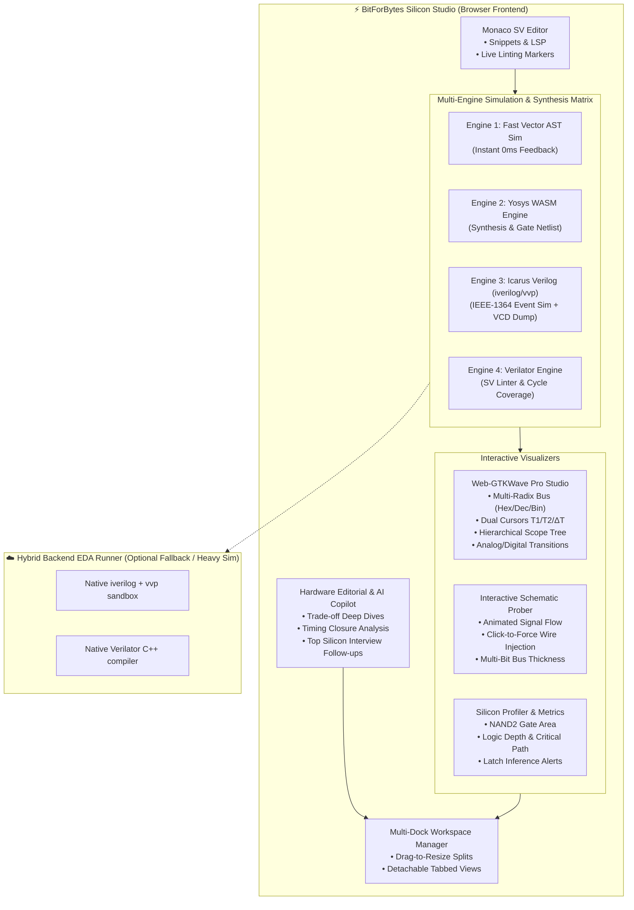

# 🏆 The Ultimate Verilog Judge & Silicon IDE — World-Class Master Implementation Plan

> **BitForBytes Hardware-LeetCode (Verilog Judge)**: A revolutionary online Verilog/SystemVerilog IDE, simulator, multi-engine verification platform, and VLSI interview training arena.

---

## 1. Executive Vision: Building the World's Best Verilog Platform

Today's hardware learning tools are fragmented:
- **HDLBits**: Great problem bank, but uses an outdated, clunky UI with static waveform images and no interactive schematic or synthesis insights.
- **EDA Playground**: Powerful, but raw, slow, lacks automated grading, lacks guided progression, and has zero gamification or interactive circuit probing.
- **Commercial EDA (Vivado / ModelSim / Quartus)**: Bloated 50GB installations with steep learning curves and no browser-accessible micro-learning.

### The BitForBytes Verilog Judge Breakthrough:
We will combine **instant browser responsiveness**, **multi-engine EDA precision** (Icarus Verilog + Verilator + Yosys), **pro Web-GTKWave waveform studio**, **live animated schematic prober**, **synthesis area/delay profiling**, and a **100+ problem silicon curriculum** into an electric, neo-brutalist / sleek dark cyber-engineering workspace.



---

## 2. Multi-Engine Simulation & Compilation Architecture

The platform uses an intelligent **Multi-Tier EDA Pipeline** tailored for instantaneous student feedback:

```
┌─────────────────────────────────────────────────────────────────────────────┐
│                       MULTI-ENGINE COMPILATION MATRIX                       │
├───────────────────┬──────────────────────────┬──────────────────────────────┤
│ ENGINE            │ PRIMARY ROLE             │ KEY CAPABILITIES             │
├───────────────────┼──────────────────────────┼──────────────────────────────┤
│ 1. VectorSim AST  │ Instant keystroke grading│ 0ms latency, multi-bit,      │
│    (Pure TS)      │ & fast testbenches       │ procedural always_comb/ff    │
├───────────────────┼──────────────────────────┼──────────────────────────────┤
│ 2. Yosys WASM     │ Synthesis, Gate mapping, │ Real ASIC cell mapping,      │
│    (YoWASP Worker)│ Schematic & Area metrics │ NAND2 gate count, logic depth│
├───────────────────┼──────────────────────────┼──────────────────────────────┤
│ 3. Icarus Verilog │ IEEE-1364 Standard Sim,  │ Delays (#10), $display,      │
│    (iverilog/vvp) │ VCD waveform generation  │ system tasks, behavioral tb  │
├───────────────────┼──────────────────────────┼──────────────────────────────┤
│ 4. Verilator      │ SystemVerilog Linting &  │ IEEE-1800 compliance, line/  │
│    (C++ Sim/Lint) │ Cycle-accurate grading   │ toggle coverage, hazard check│
└───────────────────┴──────────────────────────┴──────────────────────────────┘
```

### Engine 1: Pure TypeScript AST & Procedural Vector Simulator (`vectorSim.ts`)
- **Arbitrary Bit-Widths**: 1-bit to 128-bit buses via BigInt masking.
- **Syntax Coverage**:
  - Continuous `assign` with vector slices (`bus[7:4]`), concatenation (`{a, b, 2'b00}`), replication (`{8{1'b1}}`).
  - Procedural combinational `always @(*)` and `always_comb` with full AST evaluation for `if / else if / else`, `case / casez / casex`, and `default`.
  - Blocking (`=`) and non-blocking (`<=`) assignments.
  - Multi-register sequential `always @(posedge clk or posedge rst)` with synchronous/asynchronous reset, clock enable, and complex multi-bit next-state transitions.
  - Built-in latch detection (flags missing assignments in procedural branches).

### Engine 2: Embedded Yosys WASM RTL Synthesis & Netlist Analyzer (`yosysClient.ts`)
- Runs `@yowasp/yosys` inside a Web Worker.
- Synthesizes Verilog to generic logic gates (`$_AND_`, `$_OR_`, `$_XOR_`, `$_MUX_`, `$_DFF_P_`).
- Generates JSON netlist for the interactive schematic visualizer.
- Computes cell counts, gate-equivalent area, and topological logic depth.

### Engine 3: Icarus Verilog (`iverilog` + `vvp`) Simulation & VCD Generation
- **Client & Backend Dual Modes**:
  - **In-Browser / WebAssembly**: Runs compiled `iverilog` WASM worker to compile `design.v` + `testbench.v` in sandbox memory.
  - **Backend EDA Runner Service** (`/api/verilog/simulate`): Express API invoking native `/opt/homebrew/bin/iverilog` (or Linux Docker container) with hard execution timeouts (5s max) and output sandboxing.
- Generates standard IEEE 1364 **Value Change Dump (`.vcd`)** files containing exact timestamps, signal transitions, and hierarchy.

### Engine 4: Verilator SystemVerilog Linter & Fast Compiler
- Runs `verilator --lint-only -Wall` to provide industry-standard SystemVerilog diagnostic errors:
  - `UNDRIVEN`: Undriven net detection.
  - `UNUSED`: Unused wires or ports.
  - `WIDTH`: Bit-width mismatch warnings (e.g. assigning 8-bit to 4-bit without explicit slice).
  - `COMBDLY`: Non-blocking delays inside combinational blocks.
  - `MULTIDRIVEN`: Multiple drivers fighting on the same wire.
- Generates **Code Coverage Metrics**:
  - **Line Coverage**: % of lines executed during testbench.
  - **Toggle Coverage**: % of signals that transitioned $0 \to 1$ and $1 \to 0$.
  - **FSM State Coverage**: Verification that every state in an enum/parameter state machine was visited.

---

## 3. Web-GTKWave Pro Digital Waveform Studio

A dedicated, GPU/Canvas/SVG-accelerated digital waveform studio matching and surpassing desktop **GTKWave**:

```
┌─────────────────────────────────────────────────────────────────────────────┐
│                        WEB-GTKWAVE PRO WAVEFORM STUDIO                      │
├───────────────────┬─────────────────────────────────────────────────────────┤
│ Scope Hierarchy   │ 0ns        10ns       20ns       30ns       40ns        │
├───────────────────┼─────────────────────────────────────────────────────────┤
│ ▼ top             │ ───┬───┬───┬───┬───┬───┬───┬───┬───┬───┬───┬───┬───┬───┬─│
│   ▼ uut           │ ▲0     ▲1      ▲2      ▲3      ▲4      ▲5      ▲6       │
│     clk           │ ─┐ ┌─┐ ┌─┐ ┌─┐ ┌─┐ ┌─┐ ┌─┐ ┌─┐ ┌─┐ ┌─┐ ┌─┐ ┌─┐ ┌─┐ ┌─┐ ┌─│
│     rst_n         │ ───┘ └──────────────────────────────────────────────────│
│   ▶ data_in[7:0]  │ ╳ 0x00 ╳ 0x1A   ╳ 0xFF   ╳ 0x42   ╳ 0x99   ╳ 0x00       │
│   ▶ q_out[7:0]    │ ╳ 0x00 ╳ 0x00   ╳ 0x1A   ╳ 0xFF   ╳ 0x42   ╳ 0x99       │
│     state[1:0]    │ ╳ IDLE ╳ READ   ╳ PROC   ╳ WRITE  ╳ IDLE   ╳ IDLE       │
│   ▶ got (yours)   │ ╳ 0x00 ╳ 0x00   ╳ 0x1A   ╳ 0xFE ! ╳ 0x42   ╳ 0x99       │
│                   │                         [Mismatch at 32ns: got 0xFE]     │
├───────────────────┴─────────────────────────────────────────────────────────┤
│ Cursors: T1: 15.0ns | T2: 32.0ns | ΔT: 17.0ns (58.82 MHz) | Radix: [HEX▼]   │
└─────────────────────────────────────────────────────────────────────────────┘
```

### Key Waveform Capabilities:
1. **Full VCD Stream Parser (`vcdParser.ts`)**:
   - Parses standard IEEE VCD files produced by Icarus Verilog or testbenches.
   - Extracts time-scale (`1ns`, `10ps`), signal definitions (`$var wire 8 # data [7:0] $end`), scope hierarchies (`$scope module uut $end`), and value changes.
2. **Multi-Radix Bus Decoding**:
   - One-click toggle between **Hexadecimal** (`0x3F`), **Unsigned Decimal** (`63`), **Signed 2's Complement Decimal** (`-1`), **Binary** (`00111111`), **Octal** (`077`), and **ASCII** (`'?'`).
   - Custom **FSM State String Aliasing** (e.g. `2'b00 -> IDLE`, `2'b01 -> LOAD`, `2'b10 -> WORK`, `2'b11 -> DONE`).
3. **Dual Interactive Time Cursors ($T_1, T_2, \Delta T$)**:
   - Click to place primary cursor $T_1$; Shift-click to place secondary cursor $T_2$.
   - Real-time measurement readout displaying $T_1$, $T_2$, difference $\Delta T = |T_2 - T_1|$, and equivalent frequency $f = 1 / \Delta T$.
4. **Hierarchical Signal Rack (Drag & Drop)**:
   - Expandable scope tree (`top -> uut -> alu_core -> adder_slice`).
   - Checkbox or drag signals from tree into active waveform timeline.
5. **Smart Edge Navigation & Glitch Hunter**:
   - Jump to next/previous **rising edge ($\uparrow$)**, **falling edge ($\downarrow$)**, or **any transition ($\updownarrow$)** on selected signal.
   - Glitch detector: highlights sub-cycle pulses and race conditions in red amber.
6. **Visual Diff Error Shading**:
   - Automatically overlays student output vs golden reference output.
   - Mismatched cycles shaded in soft neon red with tooltip: `Expected: 0x5A | Got: 0x58 (Bit 1 inverted)`.
7. **Analog Waveform Mode**:
   - Renders multi-bit buses as continuous stepped analog curves (ideal for PWM, DACs, counters, sine generators, and FIR filters).

---

## 4. Interactive RTL Schematic & Live Circuit Prober

Building on the existing Yosys renderer, the schematic becomes a live, interactive EDA canvas:

```
┌─────────────────────────────────────────────────────────────────────────────┐
│                   INTERACTIVE LIVE SCHEMATIC CANVAS                         │
├─────────────────────────────────────────────────────────────────────────────┤
│  [Zoom: 100%] [Fit] [Export SVG] [Export PNG] [Animate Flow: ON]            │
│                                                                             │
│  [clk] ────────►[ D-FF  ]                                                   │
│                 │   Q   │────────►[ AND2 ]                                  │
│  [d]   ────────►[ D     ]         │      │────────► [y_out] = 1 (PROBED)    │
│                                   │      │                                  │
│  [en]  ──────────────────────────►[      ]                                  │
│                                                                             │
│  * Click wire to force logic value (0, 1, High-Z)                           │
│  * Animated glowing pulses represent signal propagation                     │
│  * Thick bus wires with slash-width ticks (/8, /32)                         │
└─────────────────────────────────────────────────────────────────────────────┘
```

### Key Schematic Upgrades:
- **Animated Logic Flow**: When inputs toggle or clock ticks, animated glowing energy pulses travel through the gates according to propagation delay.
- **Multi-Bit Bus Styling**: Wide buses rendered with distinct color coding, double-line weight, and slash-width notations (`/4`, `/8`, `/16`, `/32`).
- **Interactive Wire Forcing**: Click any net to force its value to `0`, `1`, or release to simulator default.
- **Hierarchical Module Drill-Down**: Click submodule boxes to navigate into sub-circuit schematics (e.g. drilling down from a 4-bit RCA into 4 Full Adder slices).
- **Pro Export**: 1-click export of publication-ready SVG, PNG, and PDF schematics for resume portfolios, university lab reports, and technical blogs.

---

## 5. Hardware Synthesis & Silicon Complexity Profiler

A dedicated panel giving students real ASIC/FPGA hardware metrics:

```
┌─────────────────────────────────────────────────────────────────────────────┐
│                    SILICON SYNTHESIS & HARDWARE PROFILER                    │
├─────────────────────────────────────────────────────────────────────────────┤
│  📊 ASIC ESTIMATED AREA: ~48 NAND2 Equivalent Gates (0.00012 mm² @ 28nm)   │
│  ⏱️ ESTIMATED CRITICAL PATH: 3 Gate Levels (~0.42 ns estimated delay)      │
│  📦 CELL HISTOGRAM:                                                         │
│     • $_DFF_P_ (D Flip-Flop):  4 instances (4 bits state)                   │
│     • $_MUX_   (Multiplexer):  8 instances                                  │
│     • $_XOR_   (XOR Gate):     4 instances                                  │
│     • $_AND_   (AND Gate):     6 instances                                  │
│     • Latches Inferred:        0 (CLEAN - No unintended memory)            │
│                                                                             │
│  ⚠️ RTL LINT & TIMING WARNINGS:                                             │
│     ✓ No combinational loops detected                                       │
│     ✓ All output ports driven                                               │
│     ✓ Sensitivity list is complete                                          │
│                                                                             │
│  🏆 HARDWARE EFFICIENCY BENCHMARK:                                          │
│     Your design uses 22 gates. Top 15% most area-efficient solutions!       │
└─────────────────────────────────────────────────────────────────────────────┘
```

---

## 6. Comprehensive 100+ Problem Silicon Curriculum

A master curriculum modeled after real silicon company interview loops (Apple, NVIDIA, Intel, Qualcomm, AMD, Broadcom, TI):

```
┌─────────────────────────────────────────────────────────────────────────────┐
│                 100+ PROBLEM SILICON CURRICULUM ROADMAP                     │
├───────────────────┬────────────┬────────────────────────────────────────────┤
│ TRACK             │ PROBLEMS   │ TOPICS COVERED                             │
├───────────────────┼────────────┼────────────────────────────────────────────┤
│ 1. Gates & Basics │ 1 - 15     │ Wires, Inverters, AND/OR/XOR/NAND/NOR/XNOR,│
│                   │            │ 2-to-1 MUX, 4-to-1 MUX, Decoders, Majority │
├───────────────────┼────────────┼────────────────────────────────────────────┤
│ 2. Vectors & Bus  │ 16 - 30    │ Bus slicing [7:0], Bit reversal, Endianness│
│                   │            │ swap, Concatenation, Sign extension, Redux │
├───────────────────┼────────────┼────────────────────────────────────────────┤
│ 3. Arithmetic &   │ 31 - 45    │ Half/Full Adders, 4-bit RCA, 4-bit CLA,    │
│    Datapath RTL   │            │ Subtractor, 4-bit ALU + Flags, Multiplier, │
│                   │            │ 8:3 Priority Encoder, BCD-to-7Seg Decoder  │
├───────────────────┼────────────┼────────────────────────────────────────────┤
│ 4. Sequential RTL │ 46 - 60    │ D-FF (Async/Sync/Enable), SISO/SIPO/PIPO   │
│    & Counters     │            │ Shift Registers, Up/Down Counter, Decade,  │
│                   │            │ Gray Counter, Ring/Johnson, Edge Detectors │
├───────────────────┼────────────┼────────────────────────────────────────────┤
│ 5. Finite State   │ 61 - 75    │ Moore & Mealy FSMs, "1011"/"1101" Sequence │
│    Machines (FSM) │            │ Detectors, Traffic Light Controller,       │
│                   │            │ Vending Machine, Serial Framing Bit Parser │
├───────────────────┼────────────┼────────────────────────────────────────────┤
│ 6. Memory & FIFOs │ 76 - 85    │ 16x8 Single/Dual Port RAM, Synchronous FIFO│
│                   │            │ (Full/Empty/Pointers), LFSR PRNG, CDC 2FF  │
├───────────────────┼────────────┼────────────────────────────────────────────┤
│ 7. Bus Protocols  │ 86 - 95    │ Valid/Ready Handshake, AXI-Stream Skid     │
│    & Interfaces   │            │ Buffer, UART Transmitter/Receiver, SPI Core│
├───────────────────┼────────────┼────────────────────────────────────────────┤
│ 8. RISC-V Blocks  │ 96 - 100+  │ RV32I Instruction Decoder, Register File   │
│    & Top FAANG HW │            │ 32x32, Program Counter unit, Branch Logic  │
└───────────────────┴────────────┴────────────────────────────────────────────┘
```

---

## 7. Next-Gen IDE & UI/UX Experience

### Monaco Editor Pro Hardware Environment:
- **Custom SystemVerilog Language Server Definition**:
  - Full keyword syntax highlighting for IEEE 1800-2017 (`always_comb`, `always_ff`, `always_latch`, `logic`, `byte`, `int`, `typedef enum`, `parameter`, `localparam`, `generate`).
  - Snippet library: Type `ff` $\to$ Tab expands into clean `always @(posedge clk or posedge rst)` block; type `fsm` $\to$ expands into 3-process FSM template.
  - Inline error squiggles & diagnostics from Verilator / Yosys / VectorSim.
  - Shortcut commands: `Ctrl+Enter` (Submit & Grade), `Ctrl+'` (Run Custom Vector), `Alt+F` (Format Verilog).

### Multi-Dock Workspace Layout:
- Flexible 3-column / 2-row layout with persistent drag dividers:
  - **Left**: Problem Statement, I/O Port Specifications, Expected Examples, Reference Waveform, and Track Navigator.
  - **Middle**: Monaco Editor with Design & Testbench tabs, Custom Test Vector bar, and Submit Toolbar.
  - **Right (Tabbed)**:
    - `Web-GTKWave`: Pro Waveform Studio with multi-radix signals & cursors.
    - `Live Schematic`: Yosys interactive gate-level circuit with live probing.
    - `Hardware Metrics`: Area, cell count, logic depth, and synthesis warnings.
    - `Editorial & VLSI Insights`: Architecture breakdown, timing closure notes, and interview follow-up questions.
  - **Bottom Drawer**: Console output, Truth Table diff, and Verilator Lint log.

### Gamification & Silicon Interview Arena:
- **Silicon Skill Radar**: Visual hexagonal chart measuring mastery in *Combinational Logic*, *Arithmetic RTL*, *Sequential State*, *FSM Design*, *Memory/FIFOs*, and *Protocol Architecture*.
- **Hardware Efficiency Percentiles**: Compares gate count and execution cycles against all global submissions.
- **Timed FAANG Silicon Mock Interview Mode**: 30-minute countdown timer with hidden edge-case testbenches (overflow, reset during active data, backpressure assertions).

---

## 8. Concrete Step-by-Step Implementation Matrix

### Phase 1: Core Engine & Multi-Bit AST Simulator
- [ ] Create `frontend/src/engine/verilog/vectorSim.ts` (multi-bit AST, slicing, concatenation, procedural `always_comb`/`always_ff`, `if-else`, `case`).
- [ ] Create `frontend/src/engine/verilog/vectorSim.test.ts` (comprehensive unit tests for 1-bit to 64-bit logic, arithmetic, shift, and FSM operations).
- [ ] Update `frontend/src/engine/verilog/grade.ts` to seamlessly evaluate multi-bit vectors, truth tables, and cycle-by-cycle sequential testbenches.

### Phase 2: Icarus Verilog & Verilator Integration
- [ ] Create `frontend/src/engine/verilog/iverilogClient.ts` (WASM + backend runner integration for Icarus compilation & VCD output).
- [ ] Create `backend/src/routes/verilogRunner.ts` (secure native `iverilog` & `verilator` sandbox execution endpoint with timeouts).
- [ ] Create `frontend/src/engine/verilog/verilatorLinter.ts` (parses Verilator lint logs and emits Monaco editor markers).

### Phase 3: Web-GTKWave Digital Waveform Studio
- [ ] Create `frontend/src/engine/verilog/vcdParser.ts` (standard IEEE VCD parser & stream reader).
- [ ] Create `frontend/src/components/verilog/WebGTKWave.tsx` (pro canvas/SVG waveform viewer with multi-radix bus decoding, dual cursors $T_1/T_2/\Delta T$, scope tree, and error diff shading).
- [ ] Implement radix toggle (Hex, Dec, Signed Dec, Bin, ASCII, State strings) and edge jumping controls.

### Phase 4: Live Schematic & Silicon Metrics Visualizer
- [ ] Enhance `frontend/src/engine/verilog/netlistSim.ts` to extract cell statistics and gate counts.
- [ ] Create `frontend/src/components/verilog/HardwareMetricsPanel.tsx` (NAND2 gate-equivalent area, logic depth, cell histogram).
- [ ] Enhance `frontend/src/components/verilog/SynthSchematicView.tsx` with multi-bit bus rendering (`/4`, `/8`), animated logic flow, and PNG/SVG export.

### Phase 5: 100+ Problem Bank & Curriculum Expansion
- [ ] Expand `frontend/src/data/verilogProblems.ts` with 100+ categorized problems across all 8 tracks (Basics, Vectors, Arithmetic/ALU, Sequential/Counters, FSMs, Memory/FIFOs, Protocols, and RISC-V building blocks).
- [ ] Add golden solutions and automated unit tests for every new problem in `grade.test.ts`.

### Phase 6: Next-Gen IDE & Multi-Dock Workspace UI
- [ ] Update `frontend/src/pages/VerilogJudge.tsx` with the multi-dock tabbed workspace, Monaco SV grammar, custom vector injector, and Mock Interview mode.
- [ ] Create `frontend/src/components/verilog/EditorialView.tsx` (reference architecture, hardware trade-offs, and VLSI interview questions).
- [ ] Add Silicon Skill Radar and submission hardware percentile benchmarks.

---

## 9. Verification & Quality Assurance Protocol

### Automated Test Matrix
```bash
# 1. Frontend Unit & Grader Test Suite
cd frontend && npm run test

# 2. Golden Solution Verification (All 100+ problems tested against golden testbenches)
npm run test -- grade.test.ts

# 3. Vector AST Engine Verification
npm run test -- vectorSim.test.ts

# 4. Production Build & TypeScript Integrity Check
npm run build
```

### Manual & E2E Validation Flow
1. **Combinational Vector Test**: Solve 4-bit ALU problem; verify multi-bit bus truth table and schematic.
2. **Sequential Clock Test**: Solve 4-bit Johnson Counter; verify Web-GTKWave waveform cycles, cursor $T_1/T_2/\Delta T$ measurement, and hex radix.
3. **FSM Sequence Detector**: Solve "1011" Moore FSM; verify state transitions on GTKWave and latch detection check in Hardware Metrics.
4. **Verilator / Icarus Lint Test**: Submit intentionally unassigned branch; verify inline Monaco gutter warning and detailed lint explanation.
5. **Schematic Prober**: Click live wires in schematic; verify logic value forcing and SVG export.

---

*This plan establishes the BitForBytes Verilog Judge as the world's standard for interactive silicon engineering education.*
