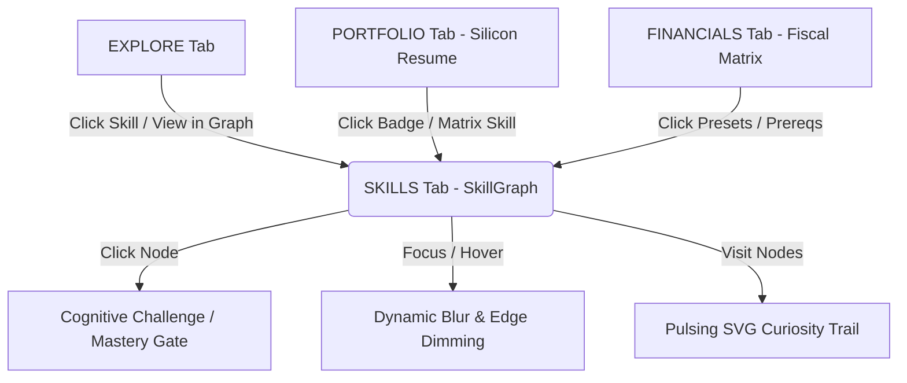

# BitforBytes Career Roadmap Immersion Report
*Date: July 11, 2026*
*Status: Completed & Visualized*

---

## 🎯 Executive Summary & Objective
The **BitforBytes Career Roadmap** dashboard has been transformed from a flat informational interface into an atmospheric, highly interactive engineering exploration tool. The core design is structured to drive curiosity-based discovery (resembling a "Wikipedia rabbit hole") where users are encouraged to explore connection paths across ECE disciplines.

The implementation connects professional data (Silicon Resumes and Fiscal compensation matrices) with the technical requirements of the central interactive **2D SkillGraph**, allowing users to hop between pages while preserving their traversal history.



---

## 🏛️ System Architecture & State Synchronization

The interaction layer operates on a decoupled state system:

1. **Central State Management (`useCareerState.ts`)**:
   * Coordinates the `focusedNodeId` (currently focused skill) across all active tabs.
   * Maintains `nodeVisitHistory`, tracking the sequence of clicked/focused skills.
   * Persists the exploration history and user settings across page sessions via `localStorage` keys (`bfb_curiosity_trail_v2`, `bfb_career_v3_state`).
2. **2D Interactive Canvas (`SkillGraph.tsx`)**:
   * Powered by `react-zoom-pan-pinch` for fluid panning and zooming.
   * Auto-calculates hierarchical node coordinate layouts using DAGRE (`dagre.graphlib.Graph`) with customization options for TB (Top-to-Bottom) and LR (Left-to-Right) alignments.
   * Responds to changes in `focusedNodeId` by animating the camera viewport directly onto the corresponding DOM element identifier.

---

## 🔧 Detailed Walkthrough of Completed Phases

### Phase 1: Cross-Tab Redirection & Focus Zooms
* **Fiscal Matrix Interconnects**: Clickable chips for salary bands/presets invoke `onFocusSkillNode`, passing the clean mapping ID directly to the state machine.
* **Silicon Resume**: Verification badges and technical matrix skills are rendered as active, style-matched interactive chips that route user focus back to the SkillGraph.
* **Smooth Camera Target Zooming**:
  * Utilizes `transformRef.current.zoomToElement` with a target ID of `node-cell-${node.id}`.
  * Adjusts zoom scales dynamically (`scale: 1.25`) with cubic easing transitions (`900ms`) to provide instant, pleasant focus feedback.

### Phase 2: "Appears In" Cross-Tab Context
* Surfaced a specialized `NODE_APPEARANCES` index map defining exactly where each skill node is linked in the system.
* Upgraded the HTML/CSS popup tooltip card to show a detailed summary of corresponding pages when the node is hovered or active.
* Users can trace how a single skill relates to both industrial roles (Fiscal Matrix) and academic domains.

### Phase 3: Peripheral Mystery (Focus Dimming)
* **Node Dimming**: Non-focused nodes are visually blurred and reduced in opacity:
  * Dimmed Scale: `0.25 opacity`
  * Blur Filter: `blur(1.5px)`
* **Edge Dimming**: Connections that do not lie in the active upstream or downstream path are faded out to `0.05` opacity.
* The target node, its direct prerequisites, and its immediate dependents retain full high-contrast visibility, guiding the user's focus dynamically.

### Phase 4: SVG Curiosity Trail with Neon Glow
* Implemented a custom SVG `<defs>` block defining a standard dual-pass glow filter:
  ```xml
  <filter id="green-glow" x="-20%" y="-20%" width="140%" height="140%">
    <feGaussianBlur stdDeviation="4" result="blur" />
    <feMerge>
      <feMergeNode in="blur" />
      <feMergeNode in="SourceGraphic" />
    </feMerge>
  </filter>
  ```
* Draws a pulsing green glow line underneath a sharp dashed path connecting visited nodes.
* Contains animated SVG `<circle>` nodes with `<animateMotion>` matching the path coordinates.
* Preserves visitor sequences through browser reloads by loading from and writing to `localStorage`.

---

## 📁 Key File Changes

Below is a summary of the exact modifications made across the codebase to implement this system:

### 1. `SkillGraph.tsx`
* Added `Sparkles` icon imports.
* Linked `TransformWrapper` to the local `transformRef` reference.
* Implemented dynamic class animations and SVG nodes for the **Curiosity Trail** inside the viewport container.
* Added `id={`node-cell-${node.id}`}` inside the mapped node renderer to enable target centering.
* Added the custom visual details card containing the **Appears In** list lookup.

### 2. `useCareerState.ts`
* Added persistent state loaders for `nodeVisitHistory`.
* Added `useEffect` listeners that automatically push focused nodes to the history queue, guaranteeing that redirection jumps from external components are recorded.

### 3. `FiscalMatrix.tsx` & `SiliconResume.tsx`
* Exposed the `onFocusSkillNode` callback.
* Integrated clickable, glowing badges and chips for preset roles and verified certifications.

---

## 🧪 Visual Testing & Verification
The system was verified using a local headless browser subagent on Vite dev server `http://localhost:5174/career-roadmap` with the following confirmations:
* **Splash Screen Transition**: Successfully bypassed the cold open by clicking the main path triggers.
* **Redirection Flow**: Verified that clicking `VERILOG/VHDL` in the *Fiscal Matrix* or *Silicon Resume* correctly shifts the active tab view to `SKILLS` and performs the animated focus zoom on the graph node.
* **Dimming & Focus**: Confirmed that peripheral elements correctly blur and fade to low opacity when a skill node is focused.
* **Curiosity Pathing**: Validated that clicking nodes generates a glowing, animated path line that updates in real-time.

> [!TIP]
> **Performance Tip:** All animations leverage GPU-accelerated CSS filters and lightweight SVG elements instead of heavy WebGL renders, maintaining a steady 60fps on standard client laptops.

---

## 📈 Future Progression Suggestions
1. **Interactive Path Simulator**: Expand `TrajectorySimulator` to display the simulated progression directly overlaying the 2D SkillGraph coordinates.
2. **Interactive Node Mini-Quizzes**: Implement progressive cognitive challenges for all remaining skills to drive user mastery points.
3. **Export Resume PDF**: Enhance the PDF download features in `SiliconResume` to capture and embed these verified skill graph states visually.
