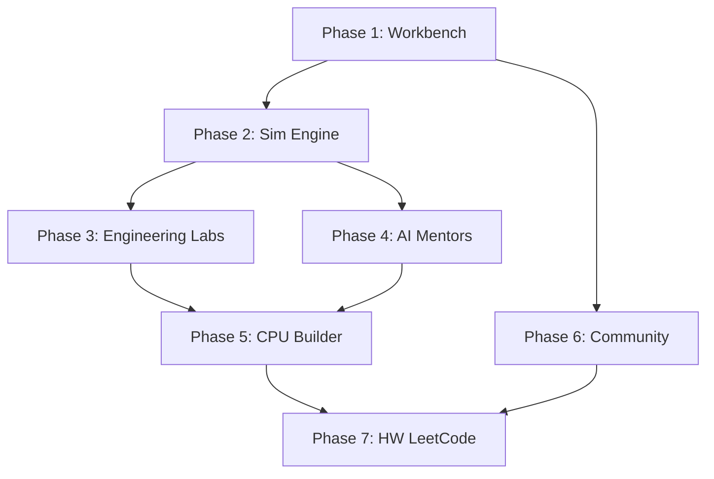

# DigiLogic Platform — Master Implementation Plan

> **Goal:** Transform VeriLog into a complete digital engineering operating system — Duolingo + Logisim + HDLBits + MIT Lab + LeetCode in one unified platform.

> [!IMPORTANT]
> All phases respect the **single source of truth**: `gamificationStore.ts` (v2). No new global stores will be introduced.

---

## Current State Audit

| System | Status | File(s) |
|--------|--------|---------|
| gamificationStore (v2) | ✅ Stable | `stores/gamificationStore.ts` |
| MUREEngine | ✅ Stable | `mure/MUREEngine.ts` + core/* |
| LogicOscilloscopeEngine | ✅ Stable | `engine/LogicOscilloscope.ts` |
| VisualCanvasEngine | ✅ Stable | `engine/VisualCanvasEngine.ts` |
| FSM Studio | ✅ Stable | `pages/FSMPlayground.tsx`, `engine/FSMEngine.ts` |
| Verilog Playground | ✅ Stable | `pages/VerilogPlayground.tsx` |
| Levels 1–5 | ✅ Stable | `pages/Module{One..Five}.tsx` |
| SIGMA Mentor (L3/L4) | ✅ Stable | `hooks/useSigmaMentorL3.ts`, `useSigmaMentorL4.ts` |
| VoltMonkey Mentor (L2/L5) | ✅ Stable | `hooks/useVoltMonkeyMentorL2.ts`, `useVoltMonkeyL5.ts` |
| CPU Architecture (interfaces only) | ✅ Stable | `engine/CPUSystemArchitecture.ts` |
| SkillCanvas / ElectricParticleField | ✅ Stable | `components/ui/SkillCanvas.tsx`, `backgrounds/` |
| TypeScript compilation | ✅ 0 errors | — |

---

## Phase 1 — Platform Stabilization & Unified Workbench

**Goal:** Create the professional Engineering Workbench that unifies all existing tools into a single resizable workspace.

### 1.1 Resizable Panel System
- **[NEW]** `components/workbench/PanelManager.tsx` — Drag-resizable split panels (like VS Code)
- **[NEW]** `components/workbench/PanelContainer.tsx` — Wraps any tool (canvas, oscilloscope, truth table) into a dockable panel
- **[NEW]** `hooks/usePanelLayout.ts` — Layout state manager (persist panel sizes/positions to localStorage)

### 1.2 Command Palette (Ctrl+K)
- **[NEW]** `components/workbench/CommandPalette.tsx` — Fuzzy-search command launcher
- **[NEW]** `data/commands.ts` — Command registry (add gate, run sim, open tool, navigate)
- **[NEW]** `hooks/useKeyboardShortcuts.ts` — Global keyboard shortcut handler (A=AND, O=OR, W=wire, P=probe, Space=play/pause, Delete=remove)

### 1.3 Engineering Workbench Page
- **[NEW]** `pages/Workbench.tsx` — Unified workspace page replacing standalone tools
- **[MODIFY]** `App.tsx` — Add `/workbench` route
- Panels: Circuit Canvas | Oscilloscope | Component Library | Console/Log

### 1.4 Console Panel
- **[NEW]** `components/workbench/ConsolePanel.tsx` — Log viewer for simulation events, errors, signal changes

### Verification
- [ ] All panels resize independently without breaking layout
- [ ] Command palette opens with Ctrl+K, fuzzy search works
- [ ] Keyboard shortcuts function in canvas context
- [ ] Panel layout persists across page reloads
- [ ] Existing tools (Logic Studio, FSM, Verilog) remain functional

---

## Phase 2 — Simulation Engine Improvements

**Goal:** Make simulation faster, non-blocking, and capable of handling complex circuits.

### 2.1 Web Worker Simulation Bridge
- **[NEW]** `engines/workers/simulationWorker.ts` — Web Worker running MUREEngine off-thread
- **[NEW]** `engines/workers/SimulationBridge.ts` — Typed message passing between UI thread and worker (postMessage/onMessage)
- **[MODIFY]** `hooks/useLogicStudio.ts` — Option to use worker-backed simulation

### 2.2 Canvas Rendering Abstraction
- **[NEW]** `engines/canvas/CanvasRenderer.ts` — Abstract renderer interface
- **[NEW]** `engines/canvas/SVGRenderer.ts` — Current SVG-based rendering (extracted from StudioCanvas)
- Architecture prep: WebGL/PixiJS renderer can be swapped in later without touching consumer code

### 2.3 Event-Driven Signal Propagation
- **[MODIFY]** `mure/core/EventQueue.ts` — Priority queue ordered by simulation time
- **[MODIFY]** `mure/core/SimulationKernel.ts` — Event-driven propagation (only recompute affected gates)
- Add gate propagation delay modeling (AND=2ns, OR=2ns, NOT=1ns)

### 2.4 Circuit Analysis Engine
- **[NEW]** `engines/analysis/CircuitAnalysisEngine.ts` — Static analysis: detect loops, floating inputs, short circuits, critical path calculation

### Verification
- [ ] Simulation runs in Web Worker without UI freezes
- [ ] Drag interactions stay smooth during simulation
- [ ] Event-driven propagation 10x+ faster for large circuits
- [ ] Circuit analysis catches common errors

---

## Phase 3 — Engineering Labs

**Goal:** Build professional debugging and analysis tools.

### 3.1 Circuit Debugger
- **[NEW]** `components/workbench/CircuitDebugger.tsx` — Debugger toolbar (Run, Pause, Step Clock, Reset)
- **[NEW]** `components/workbench/SignalWatchPanel.tsx` — Watch window for selected signals (like a software debugger's watch panel)
- **[NEW]** `components/workbench/BreakpointManager.tsx` — Set breakpoints on signal conditions (e.g., "break when Q=1")
- **[NEW]** `hooks/useCircuitDebugger.ts` — Debugger state machine (running → paused → stepping → breakpoint hit)

### 3.2 Enhanced Oscilloscope Integration
- **[MODIFY]** `components/LogicOscilloscope.tsx` — Add multi-channel view, zoom/pan controls, measurement cursors
- **[NEW]** `components/workbench/WaveformExporter.tsx` — Export waveform data as VCD/CSV

### 3.3 K-Map Lab Enhancements
- **[MODIFY]** `components/level5/KMapEngine.tsx` — Add 5-variable and 6-variable K-Map support
- **[NEW]** `components/level5/BooleanMinimizer.tsx` — Step-by-step Quine-McCluskey minimization visualizer

### Verification
- [ ] Step-through debugging works at clock-cycle granularity
- [ ] Signal watch panel updates in real-time
- [ ] Breakpoints halt simulation at correct conditions
- [ ] Oscilloscope zoom/pan functions smoothly

---

## Phase 4 — AI Mentor Expansion

**Goal:** Add specialized mentors for timing, Verilog, and architecture domains.

### 4.1 Chronos — Timing Analysis Mentor
- **[NEW]** `hooks/useChronosMentor.ts` — Analyzes propagation delays, setup/hold time violations, clock domain issues
- **[NEW]** `engines/analysis/TimingAnalyzer.ts` — Static timing analysis engine (critical path calculation, slack analysis)

### 4.2 Verity — Verilog Mentor
- **[NEW]** `hooks/useVerityMentor.ts` — HDL code review, syntax suggestions, synthesis warnings
- **[MODIFY]** `pages/VerilogPlayground.tsx` — Integrate Verity mentor panel

### 4.3 Archon — System Architecture Mentor
- **[NEW]** `hooks/useArchonMentor.ts` — Reviews system-level design (bus widths, register allocation, instruction set trade-offs)
- Integration with CPU Builder Lab (Phase 5)

### 4.4 Unified Mentor Framework
- **[NEW]** `engines/mentors/MentorFramework.ts` — Base class/interface all mentors implement (observation → analysis → suggestion pattern)
- Standardize mentor message format across all mentors

### Verification
- [ ] Chronos detects timing violations in circuits with clock signals
- [ ] Verity provides meaningful hints for common Verilog mistakes
- [ ] Mentor framework provides consistent UX across all mentors
- [ ] All mentors integrate with gamificationStore for XP awards

---

## Phase 5 — CPU Builder Lab

**Goal:** Interactive progressive CPU design experience.

### 5.1 CPU Builder Engine
- **[NEW]** `engines/cpu/CPUBuilderEngine.ts` — Implements `ICPUEngine` from existing `CPUSystemArchitecture.ts`
- **[NEW]** `engines/cpu/ALU.ts` — 8-bit ALU with ADD, SUB, AND, OR, XOR operations
- **[NEW]** `engines/cpu/RegisterFile.ts` — Register bank (A, B, IR, PC, MAR, OUT)
- **[NEW]** `engines/cpu/ControlUnit.ts` — Microcode-driven control unit (T-cycle state machine)
- **[NEW]** `engines/cpu/InstructionDecoder.ts` — OpCode → control signals decoder

### 5.2 CPU Builder UI
- **[NEW]** `pages/CPUBuilder.tsx` — Main CPU builder workspace
- **[NEW]** `components/cpu/CPUSchematic.tsx` — Interactive datapath diagram (click to inspect ALU, registers, buses)
- **[NEW]** `components/cpu/ProgramEditor.tsx` — Assembly language editor with syntax highlighting
- **[NEW]** `components/cpu/MemoryViewer.tsx` — Hex dump view of RAM (256 bytes)
- **[NEW]** `components/cpu/CPUControls.tsx` — Run, Step, Reset, Clock cycle controls
- **[NEW]** `components/cpu/BusMonitor.tsx` — Shows data flowing on the bus in real-time

### 5.3 CPU Learning Stages (Progressive)
- **[NEW]** `data/cpuStages.ts` — Stage definitions:
  1. Logic Gates (prerequisite: Module 4)
  2. Half/Full Adder → Ripple Carry Adder
  3. Registers & Latches
  4. ALU Assembly
  5. Control Unit Design
  6. Instruction Decoder
  7. Full CPU Integration
  8. Program Execution

### 5.4 Integration
- **[MODIFY]** `App.tsx` — Add `/cpu-builder` route
- **[MODIFY]** `gamificationStore.ts` — Add CPU stage skill IDs
- Connect Archon mentor for architecture guidance

### Verification
- [ ] CPU can load and execute a program (LDA, ADD, STA, OUT, HLT)
- [ ] Step-by-step execution shows T-cycle micro-operations
- [ ] Bus monitor visualizes data flow per clock cycle
- [ ] Each CPU stage unlocks via `completeSkill()`

---

## Phase 6 — Community Platform

**Goal:** Social features for sharing, forking, and collaborating on circuits.

### 6.1 Backend Schema (Supabase)
- **[NEW]** Migration: `circuits` table (id, user_id, title, description, circuit_data JSONB, gate_count, created_at)
- **[NEW]** Migration: `circuit_likes` table (user_id, circuit_id)
- **[NEW]** Migration: `circuit_comments` table (id, circuit_id, user_id, content, created_at)
- **[NEW]** Migration: `circuit_forks` table (original_id, forked_id, user_id)
- RLS policies for all tables

### 6.2 Circuit Sharing
- **[NEW]** `components/community/ShareCircuitDialog.tsx` — Publish circuit with title, description, tags
- **[NEW]** `components/community/CircuitCard.tsx` — Preview card (title, author, gate count, likes)
- **[NEW]** `hooks/useCircuitSharing.ts` — CRUD operations via Supabase client

### 6.3 Community Feed
- **[NEW]** `pages/CommunityHub.tsx` — Trending circuits, recent, most liked
- **[NEW]** `components/community/CircuitViewer.tsx` — Read-only circuit preview with "Fork" button
- **[MODIFY]** `App.tsx` — Add `/community` route

### 6.4 User Profiles
- **[NEW]** `pages/UserProfile.tsx` — Show user's circuits, badges, XP, streak
- **[NEW]** `components/community/ProfileCard.tsx` — Mini profile display

### Verification
- [ ] Users can save circuits to Supabase
- [ ] Community feed shows circuits sorted by trending/recent
- [ ] Fork creates a copy under the forker's account
- [ ] Comments render and post correctly
- [ ] RLS policies prevent unauthorized access

---

## Phase 7 — Hardware LeetCode (Competitive Challenges)

**Goal:** Ranked problem platform for digital design mastery.

### 7.1 Challenge Engine
- **[NEW]** `engines/challenges/ChallengeEngine.ts` — Validates solutions against test vectors (truth tables, timing requirements)
- **[NEW]** `data/challenges.ts` — Problem definitions:
  - **Easy:** Parity checker, 2-to-1 MUX, SR latch
  - **Medium:** Priority encoder, 4-bit counter, BCD to 7-segment
  - **Hard:** ALU design, UART transmitter, cache controller
- **[NEW]** `engines/challenges/ScoringEngine.ts` — Scores: gate count, logic depth, propagation delay, correctness

### 7.2 Challenge UI
- **[NEW]** `pages/Challenges.tsx` — Problem list with difficulty filters
- **[NEW]** `components/challenges/ChallengeProblem.tsx` — Problem description, constraints, test cases
- **[NEW]** `components/challenges/ChallengeWorkspace.tsx` — Embedded circuit builder + auto-verify
- **[NEW]** `components/challenges/LeaderboardPanel.tsx` — Rankings by problem, overall, and category

### 7.3 Backend Integration
- **[NEW]** Migration: `challenge_submissions` table (user_id, challenge_id, gate_count, depth, delay, score, circuit_data)
- **[NEW]** Migration: `leaderboard_cache` materialized view (top scores per challenge)

### 7.4 Gamification Integration
- Awards XP via `gamificationStore.awardXP('diagnostic', amount)`
- Unlock badges: `CHALLENGE_STARTER`, `10_CHALLENGES`, `TOP_10`
- Challenge streaks contribute to daily streak

### Verification
- [ ] Challenge verifier correctly validates against all test vectors
- [ ] Scoring algorithm produces consistent, comparable scores
- [ ] Leaderboard updates on new submission
- [ ] Difficulty progression feels balanced

---

## Cross-Cutting Concerns

### Performance Targets
| Metric | Target |
|--------|--------|
| Canvas rendering | 60 FPS |
| Frame time | <16ms |
| Sim step (100 gates) | <1ms |
| Command palette open | <50ms |
| Initial page load | <3s |

### Visual Design Principles
- Dark engineering theme throughout
- PCB-inspired backgrounds and patterns
- Neon signal highlights (cyan #00D4FF, green #10B981)
- IBM Plex Mono for all data/technical displays
- Subtle, educational animations with `prefers-reduced-motion` fallbacks

### Keyboard Shortcuts (Global)
| Key | Action |
|-----|--------|
| `Ctrl+K` | Command Palette |
| `A` | Add AND gate |
| `O` | Add OR gate |
| `N` | Add NOT gate |
| `W` | Wire tool |
| `P` | Probe tool |
| `Space` | Play/Pause simulation |
| `S` | Step clock |
| `Delete` | Remove selected |
| `Escape` | Cancel current action |

---

## Dependency Graph

## Estimated Effort

| Phase | New Files | Modified Files | Estimated LOC | Complexity |
|-------|-----------|----------------|---------------|------------|
| Phase 1 | ~8 | ~2 | ~1200 | Medium |
| Phase 2 | ~5 | ~3 | ~800 | High |
| Phase 3 | ~6 | ~2 | ~1000 | High |
| Phase 4 | ~5 | ~2 | ~800 | Medium |
| Phase 5 | ~10 | ~3 | ~2000 | Very High |
| Phase 6 | ~8 | ~2 | ~1200 | Medium |
| Phase 7 | ~8 | ~3 | ~1500 | High |
| **Total** | **~50** | **~17** | **~8500** | — |
